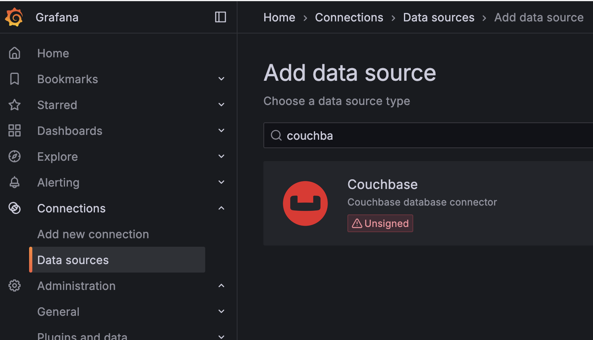

# Couchbase Data Source Plugin Installer for Grafana

This Bash script automates the installation of the Couchbase data source plugin for Grafana on macOS using Homebrew. It checks for required dependencies, installs or upgrades them as needed, downloads the plugin repository, builds the plugin, and configures Grafana to use it. The script is designed to be idempotent, meaning it can be run multiple times without redundant actions (e.g., it won’t re-download the repository if it already exists unless specified).



## Purpose

The script simplifies the process of setting up the Couchbase data source plugin for Grafana by:

- Ensuring all required tools (Homebrew, Go, Node.js, Yarn, wget, Grafana) are installed and up-to-date.
- Downloading and extracting the Couchbase plugin repository.
- Building the plugin’s backend and frontend.
- Configuring Grafana to allow unsigned plugins.
- Restarting Grafana to apply changes.

## Prerequisites

- **macOS** with **Homebrew** installed. If Homebrew is not installed, the script will exit and provide instructions to install it.
- Internet connection for downloading dependencies and the plugin repository.

## Usage

### 1. Save the Script

Copy the script into a file, e.g., `install_couchbase_plugin.sh`.

### 2. Make the Script Executable

Open a terminal and run:

```
chmod +x install_couchbase_plugin.sh
```
### 3. Run the Script
To install or check the setup:
```
./install_couchbase_plugin.sh
```

To update the plugin (re-download the repository):

```
./install_couchbase_plugin.sh --update
```

What the Script Does
Checks for Homebrew: Exits if not installed, with instructions to install it.
Checks and Installs/Upgrades Go: Ensures Go is installed and at least version 1.21.0.
Checks and Installs Node.js and Yarn: Installs if missing.
Checks and Installs Grafana: Installs if not present.
Checks and Installs wget: Installs if not present.
Sets Up Plugin Directory: Downloads and extracts the Couchbase plugin repository only if it doesn’t exist or if --update is used.
Installs Mage: If not already installed, for building the plugin.
Builds the Plugin: Compiles the backend and frontend.
Moves Built Files: Copies the correct executable (based on architecture) and frontend files to the plugin root.
Configures Grafana: Allows unsigned plugins in grafana.ini.
Restarts Grafana: Applies all changes.
Verbose Output
The script prints each step to the terminal, so you can follow along (e.g., "Checking for Go...", "Installing Node.js...", "Skipping download...").
Troubleshooting
Permissions Issues: If you encounter permission errors, adjust ownership:

```
sudo chown -R $USER:staff /usr/local/var/lib/grafana/plugins
```

Plugin Not Appearing: Check Grafana logs for errors:

```
cat /usr/local/var/log/grafana/grafana.log | grep couchbase
Architecture Mismatch: If your Mac has an ARM processor (M1/M2) but the script copies the wrong executable, manually copy the correct one:
For ARM: cp dist/gpx_couchbase_darwin_arm64 ./gpx_couchbase
For Intel: cp dist/gpx_couchbase_darwin_amd64 ./gpx_couchbase
Homebrew Not Installed: Install Homebrew from brew.sh and rerun the script.
```

Notes
The script uses the main branch of the Couchbase plugin repository. For a specific version, modify the wget URL in the script (e.g., use a tag like refs/tags/v1.0.0).
To force a plugin update, use the --update flag to re-download the repository.
The script is idempotent: it won’t reinstall tools or re-download the repository unnecessarily unless specified.
License
This script is provided under the Apache 2.0 License. See the LICENSE file for details.


---
